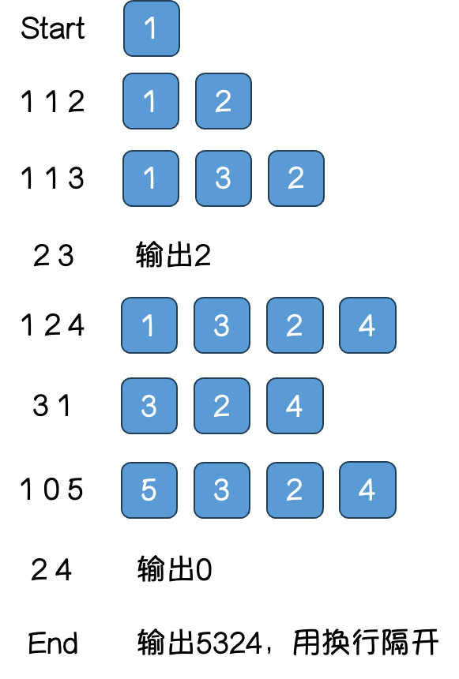

# 军训排队

by  郑凯俐

时间限制: 1000 ms

内存限制: 2000 KB

## 问题描述

军训时需要将所有同学排成一队，一开始只有教官(编号为 `1`)排在第一个，之后教官会发出如下三种命令：

`1 x y` 编号为 `y` 的同学入队，排在编号为 `x` 的同学的后面，若要排在队首，则用 `0` 表示 `x`

`2 x`   编号为 `x` 的同学报告其后面的同学编号，若要报告队首同学的编号，则用 `0` 表示 `x`，若 `x` 在队尾，则报告 `0`

`3 x`   编号为 `x` 的同学出队

要求对于每次命令 `2`，都输出报告同学后面同学的编号，并最后从头到尾输出队列中同学的编号。



## 输入格式

第一行为一个正整数 $N$，表示总共有几条命令

接下来 $N$ 行中，每行表示一个命令

## 输出格式

对于每次命令 `2`，都输出一个编号，用换行隔开

最后从头到尾输出队列，用换行隔开

## 输入样例

```
// 例如上图中的命令对应以下输入
7
1 1 2
1 1 3
2 3
1 2 4
3 1
1 0 5
2 4
```

## 输出样例

```
// 例如上图中的命令会产生以下输出
2
0
5
3
2
4
```

## 提示

1. 同学编号为小于 $100000$ 的正整数
2. 命令的条数 $N$ 为小于 $200000$ 的正整数
3. 队列中没有人时不会出现命令 `2` 和命令 `3`