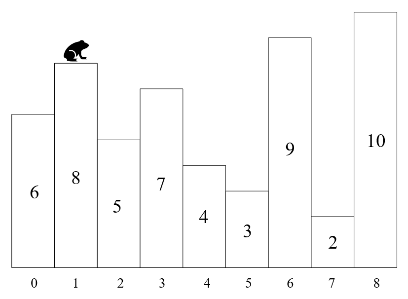

# 跳跳乐

by  陈宇豪

时间限制: 2000 ms

内存限制: 1500 KB

## 问题描述

有一系列相邻的台阶，每级台阶具有不同的高度，台阶间的水平距离相等，如图所示



有一只青蛙在不同台阶之间跳跃，设青蛙可以跳跃的最长水平距离为 $K$ 个台阶，最大的垂直距离为 $H$（需要注意的是，为简化问题，垂直距离只需考虑跳跃起点和终点的高度差，不需要考虑途中经过的台阶高度和起点的高度差），以上图为例，若 $K=5$， $H=2$，则青蛙可以从当前位置跳跃到编号为 $\{0, 3, 6\}$ 的三个台阶，因为这三个台阶与当前台阶的水平距离均不大于 $5$，且垂直距离的绝对值分别为 $\{2, 1, 1\}$，均不大于 $2$。

现在总共有 $M$ 个连续台阶，并给定每个台阶的高度，试求青蛙一共可能在多少对台阶间跳跃？

## 输入格式

输入为两行

第一行为三个整数，分别为台阶数量 $M$，青蛙可以跳跃的最长水平距离 $K$，可以跳跃的最大垂直距离 $H$

第二行为 $M$ 个整数，依次为各个台阶的高度

## 输出格式

输出为一个整数，为青蛙可以跳跃的台阶对数

## 输入样例

```
9 5 2
6 8 5 7 4 3 9 2 10
```

## 输出样例

```
14
// 可跳跃的台阶对编号分别为(0, 1), (0, 2), (0, 3), (0, 4), (1, 3), (1, 6), (2, 3), (2, 4), (2, 5), (3, 6), (4, 5), (4, 7), (5, 7), (6, 8)
```

## 提示

输入数据范围：

$M<2^{31}$， $K<2^{31}$， $H<2^{31}$，每级台阶的高度也小于 $2^{31}$

相邻两个台阶间的水平距离均相等且值为 $1$，任意两个台阶的高度均不相等