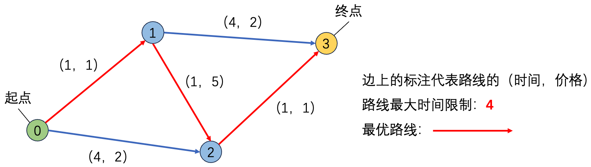

# 小明的火车旅行计划

by  Zhenqian Shen

时间限制: 1000 ms

内存限制: 20000 KB

## 问题描述

小明计划乘坐火车去远方的城市旅游。铁路系统可以被抽象为一个有向图，其中每个节点代表一个城市的火车站，边表示不同城市之间的火车线路。每条边都有两个权重，分别表示乘坐该线路所需的时间和费用。小明需要在一定的时间之内到达目的地，并且希望尽量减少花费。请问，你能帮助小明计算在满足时间要求的情况下，到达目的地所需的最低费用是多少吗？



## 输入格式

输入共 $M+2$ 行

第 $1$ 行：图的节点数、边数 $(N,M)$

第 $2$ 到 $M+1$ 行：代表 $N$ 条路径的信息，每行包括4个整数，分别代表路线起点、路线终点、路线时间、路线价格（其中时间和价格为正整数）

第 $M+2$ 行：包括 $3$ 个整数，分别代表小明的起点、目的地、路线最大时间限制

## 输出格式

一个整数，代表满足时间条件的路线中价格最小路线的价格。如果没有符合要求的路线，请输出 $-1$。

## 输入样例

```
4 5
0 1 1 1
0 2 4 2
1 2 1 5
1 3 4 2
2 3 1 1
0 3 4
```

## 输出样例

```
7
```

## 提示

图节点数 $N<2^{16}$

图边数 $M<2^{20}$

每条边对应的时间和费用 $<2^{16}$，但最终的输出可能大于这个数