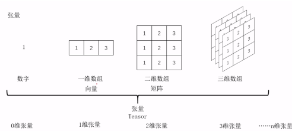

# 张量相乘的最小开销问题

by  吴世光

时间限制: 3000 ms

内存限制: 80000 KB

## 问题描述

张量（tensor）乘法和广播（broadcasting）是一种在张量之间进行运算的方法，它可以用来表示一些复杂的数学和物理问题，例如神经网络，图像处理，信号处理等。为了理解张量乘法和广播，我们首先需要了解什么是张量，以及它的形状和维度。

张量（tensor）是一种可以表示多维数组的数据结构，它可以有任意的维度和形状。维度（dimension）是张量的层次，表示张量有多少个方向或轴（axis）。形状（shape）是一个表示每个维度大小的整数元组，表示张量在每个方向上有多少个元素。例如，一个标量（scalar）是一个零维张量，它只有一个数值，没有方向，也没有形状；一个向量（vector）是一个一维张量，它有一个方向，也就是一个轴，它的形状是一个单元素的元组，表示它在这个方向上有多少个元素；一个矩阵（matrix）是一个二维张量，它有两个方向，也就是两个轴，它的形状是一个双元素的元组，表示它在这两个方向上分别有多少个元素；一个立方体（cube）是一个三维张量，它有三个方向，也就是三个轴，它的形状是一个三元素的元组，表示它在这三个方向上分别有多少个元素，以此类推。我们可以用以下的图示来表示不同维度的张量：



其中 0 维张量可用一个可表示为标量，1维张量可表示为向量，2维张量可表示为矩阵，更高维的张量可视为由低维张量作为元素构成的向量、矩阵等：

如 3 维张量可表示为

$$
\begin{bmatrix}
\begin{bmatrix}
b_{111} & b_{112} & b_{113} \\\
b_{121} & b_{122} & b_{123}
\end{bmatrix} \\\
\begin{bmatrix}
b_{211} & b_{212} & b_{213} \\\
b_{221} & b_{222} & b_{223}
\end{bmatrix}
\end{bmatrix}
$$

在张量之间进行运算时，我们需要考虑它们的形状是否匹配，以及是否需要进行广播（broadcasting）。广播是一种在支持张量的框架中，如Numpy和Pytorch，为了应对形状不同的张量进行运算所执行的操作。广播的目的是将两个不同形状的张量变成两个形状相同的张量，即先对小的张量添加轴（使其维度与较大的张量相同），再把较小的张量沿着新轴重复（使其形状与较大的相同）。例如，如果我们想要对一个形状为（2，3）的矩阵和一个形状为（3）的向量进行加法，我们可以先给向量添加一个轴，使其形状变为（1，3），然后再沿着新轴复制两份，使其形状变为（2，3），最后再与矩阵逐元素相加，得到一个形状为（2，3）的矩阵。我们可以用以下的过程来表示（注意，并非任意两个张量都能够进行广播，需要形状满足特定条件，后两段具体说明）：

$$
\begin{bmatrix}
1 & 2 & 3 \\\
4 & 5 & 6
\end{bmatrix}
+
\begin{bmatrix}
10 & 20 & 30
\end{bmatrix}
=
\begin{bmatrix}
1 & 2 & 3 \\\
4 & 5 & 6
\end{bmatrix}
+
\begin{bmatrix}
10 & 20 & 30 \\\
10 & 20 & 30
\end{bmatrix}
=
\begin{bmatrix}
11 & 22 & 33 \\\
14 & 25 & 36
\end{bmatrix}
$$

更具体而言，广播（broadcasting）是一种在支持张量的框架中，如Numpy[1] 和Pytorch[2] ，为了应对形状不同但满足某些特定条件（下一段具体说明）的张量进行运算所执行的操作。广播的目的是将两个不同形状的张量变成两个形状相同的张量，即先对小的张量添加轴（使其维度与较大的张量相同），再把较小的张量沿着新轴重复（使其形状与较大的相同）。广播兼容的张量可以进行加法，乘法等运算，运算结果的形状是两个张量形状的较大者。

广播的原则是：如果两个张量的后缘维度（trailing dimension，即从末尾开始算起的维度）的轴长度相符，或其中的一方的长度为 1，则认为它们是广播兼容的。广播会在缺失和（或）长度为 1 的维度上进行。例如，一个形状为（3，2，2，2）的 4 维张量 $A$ 和一个形状为（1，1，2，2）的 4 维张量 $B$ 是广播兼容的，它们相乘的过程如下所示，先将 $B$ 在第一维方向上复制 3 份，第二维方向上复制 2 份，这样它的形状和 $A$ 相同，之后进行逐元素乘。

$$
\begin{align*}
&\begin{bmatrix}
\begin{bmatrix}
a_{1111} & a_{1112} \\\
a_{1121} & a_{1122}
\end{bmatrix} &
\begin{bmatrix}
a_{1211} & a_{1212} \\\
a_{1221} & a_{1222}
\end{bmatrix} \\\
\begin{bmatrix}
a_{2111} & a_{2112} \\\
a_{2121} & a_{2122}
\end{bmatrix} &
\begin{bmatrix}
a_{2211} & a_{2212} \\\
a_{2221} & a_{2222}
\end{bmatrix} \\\
\begin{bmatrix}
a_{3111} & a_{3112} \\\
a_{3121} & a_{3122}
\end{bmatrix} &
\begin{bmatrix}
a_{3211} & a_{3212} \\\
a_{3221} & a_{3222}
\end{bmatrix}
\end{bmatrix}
\times
\begin{bmatrix}
\begin{bmatrix}
b_{1111} & b_{1112} \\\
b_{1121} & b_{1122}
\end{bmatrix}
\end{bmatrix} \\\
=
&\begin{bmatrix}
\begin{bmatrix}
a_{1111} & a_{1112} \\\
a_{1121} & a_{1122}
\end{bmatrix} &
\begin{bmatrix}
a_{1211} & a_{1212} \\\
a_{1221} & a_{1222}
\end{bmatrix} \\\
\begin{bmatrix}
a_{2111} & a_{2112} \\\
a_{2121} & a_{2122}
\end{bmatrix} &
\begin{bmatrix}
a_{2211} & a_{2212} \\\
a_{2221} & a_{2222}
\end{bmatrix} \\\
\begin{bmatrix}
a_{3111} & a_{3112} \\\
a_{3121} & a_{3122}
\end{bmatrix} &
\begin{bmatrix}
a_{3211} & a_{3212} \\\
a_{3221} & a_{3222}
\end{bmatrix}
\end{bmatrix}
\times
\begin{bmatrix}
\begin{bmatrix}
b_{1111} & b_{1112} \\\
b_{1121} & b_{1122}
\end{bmatrix} &
\begin{bmatrix}
b_{1111} & b_{1112} \\\
b_{1121} & b_{1122}
\end{bmatrix} \\\
\begin{bmatrix}
b_{1111} & b_{1112} \\\
b_{1121} & b_{1122}
\end{bmatrix} &
\begin{bmatrix}
b_{1111} & b_{1112} \\\
b_{1121} & b_{1122}
\end{bmatrix} \\\
\begin{bmatrix}
b_{1111} & b_{1112} \\\
b_{1121} & b_{1122}
\end{bmatrix} &
\begin{bmatrix}
b_{1111} & b_{1112} \\\
b_{1121} & b_{1122}
\end{bmatrix}
\end{bmatrix} \\\
=
&\begin{bmatrix}
\begin{bmatrix}
a_{1111}b_{1111} & a_{1112}b_{1112} \\\
a_{1121}b_{1121} & a_{1122}b_{1122}
\end{bmatrix} &
\begin{bmatrix}
a_{1211}b_{1111} & a_{1212}b_{1112} \\\
a_{1221}b_{1121} & a_{1222}b_{1122}
\end{bmatrix} \\\
\begin{bmatrix}
a_{2111}b_{1111} & a_{2112}b_{1112} \\\
a_{2121}b_{1121} & a_{2122}b_{1122}
\end{bmatrix} &
\begin{bmatrix}
a_{2211}b_{1111} & a_{2212}b_{1112} \\\
a_{2221}b_{1121} & a_{2222}b_{1122}
\end{bmatrix} \\\
\begin{bmatrix}
a_{3111}b_{1111} & a_{3112}b_{1112} \\\
a_{3121}b_{1121} & a_{3122}b_{1122}
\end{bmatrix} &
\begin{bmatrix}
a_{3211}b_{1111} & a_{3212}b_{1112} \\\
a_{3221}b_{1121} & a_{3222}b_{1122}
\end{bmatrix}
\end{bmatrix}
\end{align*}
$$

结合上述张量乘法和广播机制，以及标准的线性代数中的矩阵乘法，我们考虑如下的运算：计算 $X_1*X_2*...*X_n$，每个 $X_i$ 代表一个 $K$ 维张量。有以下说明：

1. 它们的维度数 $K$ 一样，且大于等于 2。例如都是三维张量或都是四维张量。

2. 将每一个 $K$ 维张量看成由矩阵（2 维张量) 作为元素构成的 $K-2$ 维张量。前 $K-2$ 维按照上述的张量乘法和广播进行运算，最后 2 维按照标准矩阵乘法进行运算。例如

    $$
    \begin{align*}
    &\begin{bmatrix}
    \begin{bmatrix}
    a_{1111} & a_{1112} \\\
    a_{1121} & a_{1122}
    \end{bmatrix} &
    \begin{bmatrix}
    a_{1211} & a_{1212} \\\
    a_{1221} & a_{1222}
    \end{bmatrix} \\\
    \begin{bmatrix}
    a_{2111} & a_{2112} \\\
    a_{2121} & a_{2122}
    \end{bmatrix} &
    \begin{bmatrix}
    a_{2211} & a_{2212} \\\
    a_{2221} & a_{2222}
    \end{bmatrix} \\\
    \begin{bmatrix}
    a_{3111} & a_{3112} \\\
    a_{3121} & a_{3122}
    \end{bmatrix} &
    \begin{bmatrix}
    a_{3211} & a_{3212} \\\
    a_{3221} & a_{3222}
    \end{bmatrix}
    \end{bmatrix}
    *
    \begin{bmatrix}
    \begin{bmatrix}
    b_{1111} & b_{1112} \\\
    b_{1121} & b_{1122}
    \end{bmatrix}
    \end{bmatrix} \\\
    &=
    \begin{bmatrix}
    A_{11} & A_{12} \\\
    A_{21} & A_{22} \\\
    A_{31} & A_{32}
    \end{bmatrix}
    \times
    \begin{bmatrix}
    B_{11}
    \end{bmatrix}
    =
    \begin{bmatrix}
    A_{11}B_{11} & A_{12}B_{11} \\\
    A_{21}B_{11} & A_{22}B_{11} \\\
    A_{31}B_{11} & A_{32}B_{11}
    \end{bmatrix} \\\
    &其中，A_{ij}=
    \begin{bmatrix}
    a_{ij11} & a_{ij12} \\\
    a_{ij21} & a_{ij22}
    \end{bmatrix}，B_{ij}=
    \begin{bmatrix}
    b_{ij11} & b_{ij12} \\\
    b_{ij21} & b_{ij22}
    \end{bmatrix}，A_{ij}B_{ij}=
    \begin{bmatrix}
    a_{ij11}b_{ij11} + a_{ij12}b_{ij21} & a_{ij11}b_{ij12} + a_{ij12}b_{ij22} \\\
    a_{ij21}b_{ij11} + a_{ij22}b_{ij21} & a_{ij21}b_{ij12} + a_{ij22}b_{ij22}
    \end{bmatrix}
    \end{align*}
    $$

3. 为满足最后两维按照标准矩阵乘法，相邻两个张量的后两维必须满足矩阵乘法的要求，即 $X_i$ 的最后一维大小必须等于 $X_{i+1}$ 的倒数第二维大小。

4. 为满足张量乘法和广播机制的要求，对前 $K-2$ 维中任意第 $k$ 维，任何张量 $X_i$ 在该维度的大小只能是两个取值中的一个： $1$ 或 $D_k$。 $D_k$ 为一大于 1 的正整数，对于不同维度 $k$， $k'$，对应的 $D_k$， $D_k'$可不同。前 $K-2$ 维中按照可广播的逐元素乘。即相邻两个张量 $X_i$, $X_{i+1}$ 相乘时，对于任意维度 $k: 1\leq k\leq K-2$，如果 $X_i$ 第 $k$ 维大小等于 $X_{i+1}$ 第 $k$ 维大小, 则在该维度上逐元素相乘；如果 $X_i$ 第 $k$ 维大小不等于 $X_{i+1}$ 第 $k$ 维大小，即其中一个等于 $1$，另一个等于 $D_k$，则进行广播并逐元素乘（将该维度等于 $1$ 的张量在该维度上复制 $D_k$ 份后，与另一张量在该维度上逐元素乘）。

5. 定义计算开销为需要进行的标量乘法的次数。求给定n个张量依次相乘的计算开销最小的“完全括号”方案（结合律顺序）的开销。

求：计算开销最小的“完全括号”方案（结合律顺序）的开销。

参考资料：

[1] https://numpy.org/

[2] https://pytorch.org/

更多参考资料：

https://zhuanlan.zhihu.com/p/499189580

https://pytorch.org/docs/stable/generated/torch.bmm.html

例子

三个三维张量 $X_1*X_2*X_3$，维度大小为： $X_1=[1,1,2]$， $X_2=[1,2,3]$， $X_3=[10,3,4]$, 共有两种方案：

方案 1： $(X_1*X_2)*X_3$，计算复杂度 $=1*(1*2*3)+10*(1*3*4)=126$

方案 2： $X_1*(X_2*X_3)$， $=10*(2*3*4)+10*(1*2*4)=320$

方案 1 优于方案 2，应输出 126

## 输入格式

第一行输入两个整数 $n$， $K$，代表共有 $n$ 个张量相乘，每个张量都是 $K$ 维。接下来 $n$ 行中，每行代表一个张量，有 $K$ 个由空格分隔的整数，第 $k$ 个整数代表该张量第 $k$ 维的大小。

## 输出格式

计算输入的 $n$ 个张量依次相乘的计算开销最小的“完全括号”方案（结合律顺序）的开销，输出这一整数值。

## 输入样例

```
3 3
1 1 2
1 2 3
10 3 4
```

## 输出样例

```
126
```

## 提示

数据范围 $n<2048$， $K<32$，每个维度的大小 $<1000$。

本题限制主要在于时间复杂度。